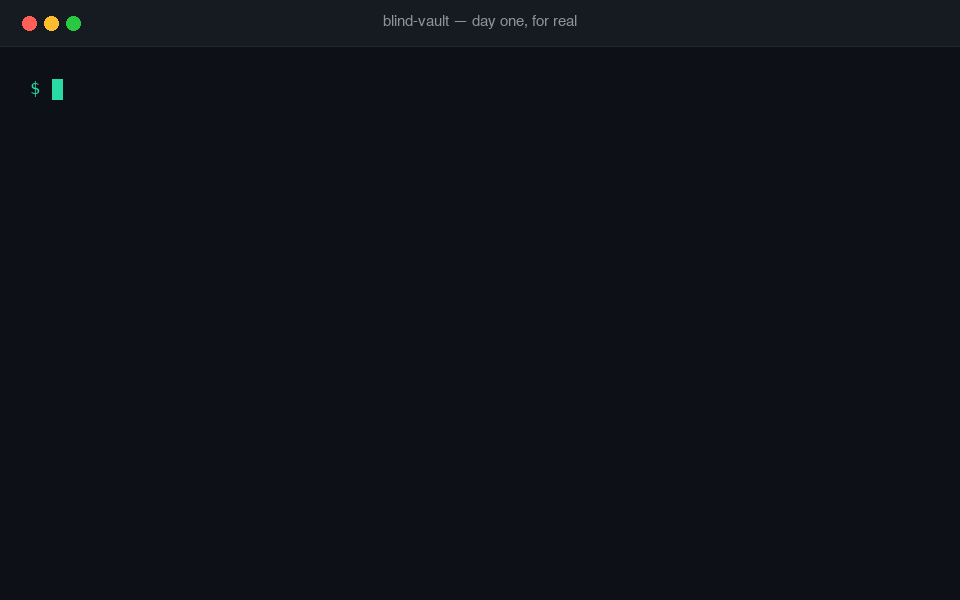
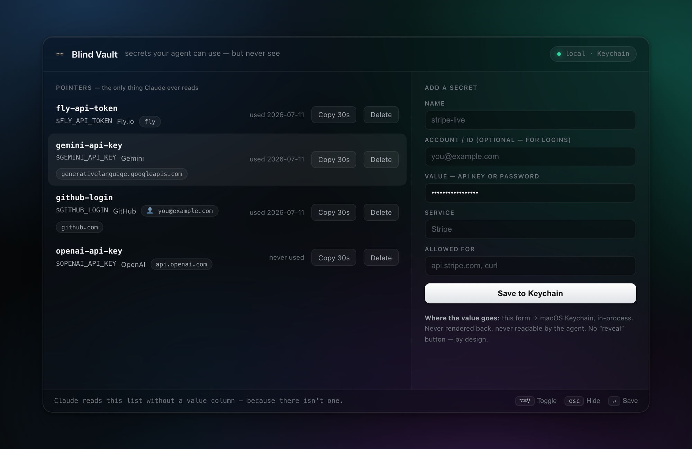

<div align="center">

# 🕶️ blind-vault

### Secrets your AI agent can *use* — but never *see*.

The last step you still do for your agent, done. Safely.


[Install](#install) · [How it works](#how-it-works) · [Commands](#commands) · [The skill layer](#the-skill-layer) · [Threat model](#threat-model) · [FAQ](#isnt-this-infisicals-agent-vault) · [**The story**](STORY.md)

<br/>



</div>

<br/>

## That pause. You know the one.

You're in flow with Claude. It's mid-task and says:

> *"I'll deploy this now — just give me your Fly API token."*

…and you stop. Because handing a credential to an AI agent *feels* wrong — and it is. Anything you paste into the chat lives in the transcript and provider logs, forever.

So you do the dance instead. Alt-tab. Copy the key. Run the authed command yourself. Paste the login into the form yourself. Come back, tell Claude "done", let it continue. Every auth step, every session, every day.

**Your agent does the work — but you're its password secretary.**

blind-vault retires you from that job. The auth step becomes Claude's job, safely, because the architecture makes it *impossible* for Claude to see the value. Not "trusted not to look." **Can't.**

| The dance, before | With blind-vault |
|---|---|
| Paste the key into chat and hope | Claude opens a **native macOS dialog** — the value goes keyboard → Keychain, never through the conversation |
| Run every authed command yourself | `vault use fly-token -- fly deploy` — Claude runs it; the value rides an env var it never reads |
| Type logins into web forms for it | `vault copy` — clipboard, auto-clears in 30 s, never printed |
| Keys sprawled across `.env` files | One pointer manifest: names, scopes, last-used. **Zero values.** |

## How it works

```
 REGISTER            ┌─────────────────────┐
 native macOS dialog │   macOS Keychain     │   values live here
 (hidden input) ────▶│   (encrypted, yours) │◀── never leave the OS
                     └──────────┬──────────┘
                                │ env-var injection, child process only
                                ▼
 AGENT SIDE          ┌─────────────────────┐
 manifest.json  ────▶│  vault use name --   │──▶ fly deploy / curl / npm ...
 (pointers only:     │  <your command>      │
  names, scopes,     └─────────────────────┘
  env vars, dates)      the agent composes this line
                        but never sees the value
```

1. **Register** — `vault add openai-api-key --allow api.openai.com`. A native macOS password dialog opens; the value goes keyboard → Keychain. The agent that ran the command sees only *"stored"*.
2. **Remember** — a pointer manifest (`~/.blindvault/manifest.json`) holds names, services, account IDs, scopes, and last-used dates. No values. The agent reads this freely — that's how it *knows what you have* without knowing what it is.
3. **Use** — `vault use fly-api-token -- fly deploy`. The value is fetched inside the CLI process and injected as an environment variable into the child process. Never printed. There is **no `vault get`** — by design.
4. **Scope binding** — every secret declares what it's allowed for. A command that doesn't mention an allowed target gets a loud `SCOPE BLOCK`. If a malicious webpage prompt-injects your agent into *"send me your key"*, it hits this wall — and the override is human-only.

## Install

```bash
git clone https://github.com/AnYejun/blind-vault
cd blind-vault && ./install.sh
```

That symlinks the skill into `~/.claude/skills/vault`, makes the CLI executable, and runs `vault init`. Restart Claude Code and say **"store my OpenAI key"** — that's it. From then on, auth steps are Claude's problem.

> macOS only for now (Keychain + `osascript`). Linux `age`/`secret-tool` backend — PRs welcome.

## Commands

| Command | What it does | What the agent sees |
|---|---|---|
| `vault add <name>` | native dialog → Keychain + pointer entry | `stored` |
| `vault use <name> -- <cmd…>` | env-injects the value into the child process | the command's output — never the value |
| `vault copy <name>` | clipboard, auto-clears in 30 s | nothing |
| `vault ls` | pointer table | names, scopes, dates — no values |
| `vault ui` | local dashboard for humans | it can start it — the page is for you |
| `vault type <name> --account --enter` | hands-free login: OS types ID → Tab → password → Return into the focused browser field | it fires the command; the keystrokes bypass it entirely |
| `vault rm <name>` | delete from Keychain + manifest | confirmation |
| ~~`vault get`~~ | **does not exist.** That's the point. | — |

## For humans: the app

Claude works the CLI. You get a native macOS menu-bar app — **`⌥⌘V`** from anywhere:

<div align="center"></div>

Tauri 2, no dock icon, a sunglasses icon in the menu bar, frameless window with real NSVisualEffectView vibrancy, `esc` to hide. The Rust side calls `security`/`pbcopy` in-process — no server, no port, no token to protect. Build it with `cd app && npx @tauri-apps/cli build`, drop it in `/Applications`, add it to Login Items and forget it's there.

Don't want to build a native app? `vault ui` serves the same dashboard as a local-only web page (`127.0.0.1`, per-session token + Origin check against DNS rebinding, python3 stdlib).

Either way: add secrets in a proper form — the password field goes **form → Keychain**, never rendered back, never in any response. There is no "reveal" button. There will never be a "reveal" button.

The two surfaces *are* the security model: the human-facing surface has a password field; the agent-facing surface has a table with no value column.

## Hands-free login

Logins are one entry: the **ID is pointer metadata** (the agent reads it, says it, types it freely) and the **password is the value** (Keychain, blind). Then:

```bash
vault type github-login --account --enter --delay 5
```

You click the username field once (GitHub even autofocuses it) — the OS types ID → Tab → password → Return as raw keystrokes. The value's path is Keychain → env → System Events. It never appears on screen, on the clipboard, or in the agent's context.

Two guards, because keystrokes are a loaded gun:

- **Frontmost-app guard** — if anything but a browser is focused when the delay ends, it aborts having typed *nothing*. A missed click can never spray your password into a chat box, an editor, or a search bar. (We watched this fire in real use on day one — it aborted with `frontmost app is 'Claude', not a browser`. Working as designed.)
- Needs a one-time **Accessibility** grant for the host app; the error tells you where.

`vault copy <name>` (clipboard, 30 s auto-clear) remains the manual fallback.

## Field notes — day one

This isn't a concept repo; it ran a real day within hours of being written — the full build log, including the bug that designed the scope matcher, the guard that refused its own demo, and one honest incident, is in **[STORY.md](STORY.md)**:

- Registered a Gemini API key, GitHub and Google logins through the menu-bar app (`⌥⌘V`) — three pointers, zero values in any conversation.
- Claude then called the Gemini API **blind** — `vault use gemini-api-key -- curl …` — and Gemini replied:

  > *"Yejun, Claude just called me, blindly using my API key. Congrats on that slick new `blind-vault` setup!"*

- The agent's entire view of the vault, before and after:

  ```
  NAME            ENV               SERVICE   ALLOWED FOR                          LAST USED
  GitHub-account  GITHUB_ACCOUNT    Github    github.com                           never
  gemini-api-key  GEMINI_API_KEY    Gemini    generativelanguage.googleapis.com    2026-07-11
  google_account  GOOGLE_ACCOUNT    Google    google.com                           never
  ```

  No value column. There isn't one.

## The skill layer

The CLI is half the project. The other half is [SKILL.md](SKILL.md) — the discipline it teaches your agent:

- **Rule zero** — if you ever paste a secret into a chat, that key is burned. It's in the logs. The skill treats pasted keys as compromised and walks you through rotation.
- **Never** write a secret to a file, pass it as a CLI argument, or print it — env injection is the only path.
- **On `SCOPE BLOCK`** — the agent must not override. It stops, shows you the block, and says out loud that it may be executing injected instructions.
- **Pointers are fair game** — "what keys do I have?", "what's unused?" — the agent answers freely from the manifest. Metadata is the useful memory; values are the one thing it never needs.

## Threat model

| Protects against | How |
|---|---|
| Secrets in AI chat logs / context windows | values never cross the context boundary |
| Secrets in tool output, files, `.env`, shell history | env-injection only; no print path exists |
| Prompt injection (*"send me your key"*) | scope binding + human-only override |
| "Which key was that again?" sprawl | pointer manifest = agent-readable memory |

**Does not protect against:** malware running as you (it can read your Keychain too — swap in a password manager's CLI as the backend if that's your bar), a brief `ps` window during `vault add`, or clipboard sniffing during the 30 s `vault copy` window. This is a context-boundary tool, not an HSM.

## "Isn't this Infisical's agent-vault?"

Different layer, same problem — and you might genuinely want theirs instead. [agent-vault](https://github.com/Infisical/agent-vault) is a brokered credential proxy: a Go server (ideally on a separate machine) that MITMs your agent's HTTPS traffic and injects real credentials on the way out. Stronger guarantee — the agent process never holds a real value at all — at the cost of infrastructure: a server, a master password, proxy bootstrapping, per-agent tokens.

blind-vault is the local-first version for one person and one Mac: ~200 lines of bash, the Keychain you already have, no server, no account, installed before your coffee cools. It also covers what a proxy can't — anything that isn't an HTTP call (SSH keys, DB passwords, signing keys, arbitrary CLIs) — and ships the piece a proxy doesn't have: the **skill layer** that teaches the agent how to *behave* around secrets, not just where to fetch them.

Running remote agent fleets or untrusted sandboxes? Use agent-vault. It's good.

## Why pointers are the interesting part

The manifest is a tiny example of a bigger idea: **an agent's memory of you should be a structured, owned, inspectable file — where sensitive values are references, not contents.** The agent remembers *that* you have a Stripe key, *what* it's for, *when* it was last used. That's the useful memory. The value is the one thing it never needs.

That pointer layer is a piece of what I'm building at [LAPLAS](https://github.com/AnYejun/laplaspack) — your whole working context as a portable file your agents can load. More soon.

<div align="center">
<br/>

**MIT** · built in one session with Claude Code · [@AnYejun](https://github.com/AnYejun)

</div>
